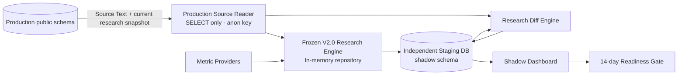

# Shadow Architecture

## Hard isolation controls

1. `APP_ENV` must equal `shadow`.
2. Production URL must match the approved Production project ref.
3. Production credentials must be an anon JWT or publishable key. A Production service-role variable is rejected.
4. Shadow database identity must match a different project ref.
5. All writer SQL explicitly targets `shadow.*`.
6. The Shadow migration statically rejects public-schema DDL/DML and compares the Staging public-schema signature before and after application.
7. `anon`, `authenticated`, `service_role`, and `PUBLIC` have no Shadow schema usage or table privileges.
8. The Shadow Dashboard is absent from application navigation and this branch is not deployed to Production.

The Production Reader implementation exposes only `select`; static tests reject `insert`, `update`, `upsert`, `delete`, or `rpc` calls.

## Runtime boundary

One replay has one deterministic `run_key`. A unique constraint grants a single database lease. A concurrent caller receives `already_running` or `already_completed`. A failed lease may be retried; a completed replay is immutable.
